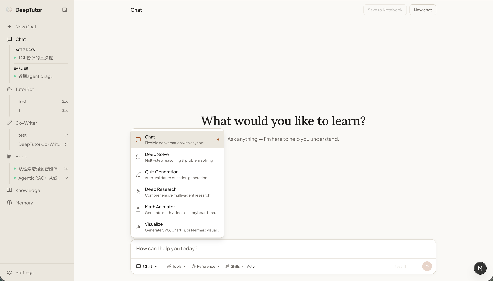
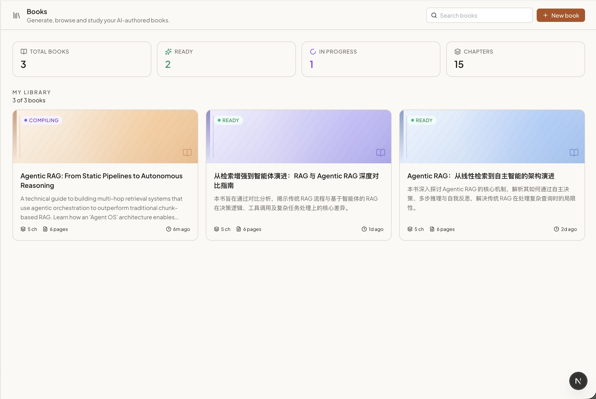
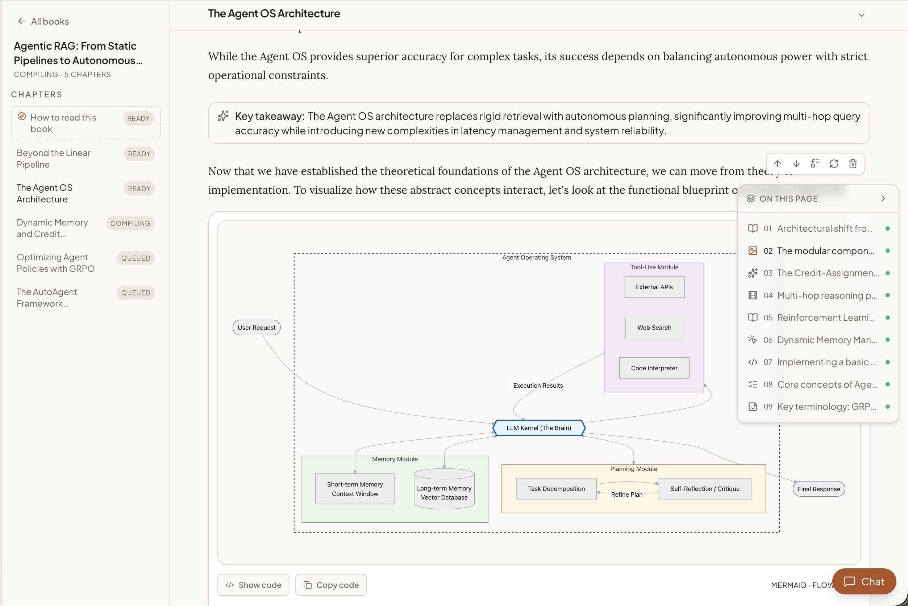
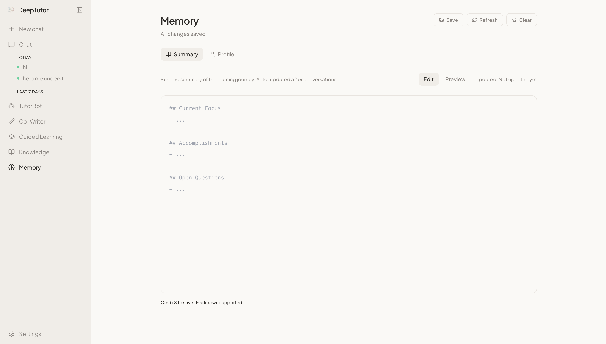
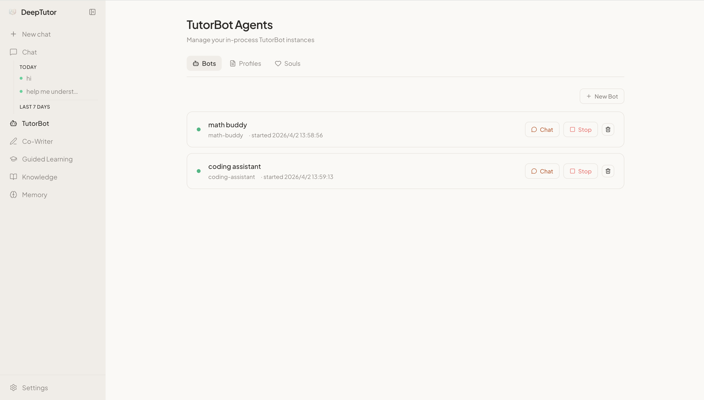
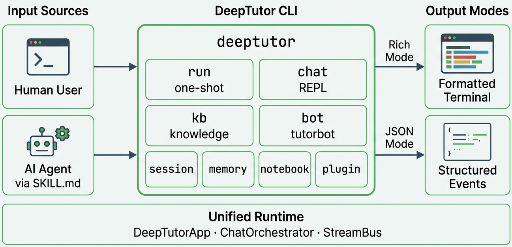
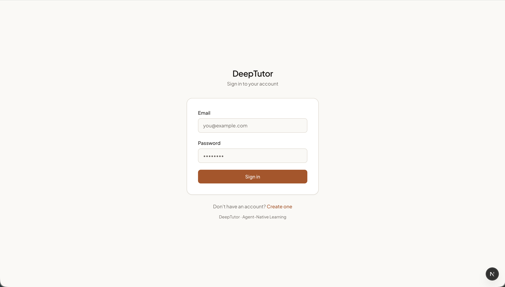

<div align="center">


# DeepTutor: tutoría personalizada nativa para agentes

<a href="https://trendshift.io/repositories/17099" target="_blank"></a>

[](https://www.python.org/downloads/)
[](https://nextjs.org/)
[](../../LICENSE)
[](https://github.com/HKUDS/DeepTutor/releases)
[](https://arxiv.org/abs/2604.26962)

[](https://discord.gg/eRsjPgMU4t)
[](../../Communication.md)
[](https://github.com/HKUDS/DeepTutor/issues/78)

[Funciones clave](#key-features) · [Primeros pasos](#get-started) · [Explorar DeepTutor](#explore-deeptutor) · [TutorBot](#tutorbot) · [CLI](#deeptutor-cli) · [Multiusuario](#multi-user) · [Hoja de ruta](#roadmap) · [Comunidad](#community)

[🇬🇧 English](../../README.md) · [🇨🇳 中文](README_CN.md) · [🇯🇵 日本語](README_JA.md) · [🇫🇷 Français](README_FR.md) · [🇸🇦 العربية](README_AR.md) · [🇷🇺 Русский](README_RU.md) · [🇮🇳 हिन्दी](README_HI.md) · [🇵🇹 Português](README_PT.md) · [🇹🇭 ภาษาไทย](README_TH.md) · 🇵🇱 [Polski](README_PL.md)

</div>

---

> 🤝 **¡Toda contribución es bienvenida!** Rama, estilo de código y primeros pasos en la [guía de contribución](../../CONTRIBUTING.md).

### 📦 Lanzamientos

> **[2026.5.10]** [v1.3.10](https://github.com/HKUDS/DeepTutor/releases/tag/v1.3.10) — Corrección de CORS en Docker remoto, `DISABLE_SSL_VERIFY` en proveedores SDK, citas seguras en bloques de código y E2EE de Matrix como complemento opcional.

> **[2026.5.9]** [v1.3.9](https://github.com/HKUDS/DeepTutor/releases/tag/v1.3.9) — TutorBot con Zulip y NVIDIA NIM, enrutamiento más seguro para modelos de razonamiento, `deeptutor start`, tooltips laterales y paridad del almacén de sesiones.

> **[2026.5.8]** [v1.3.8](https://github.com/HKUDS/DeepTutor/releases/tag/v1.3.8) — Despliegues multiusuario opcionales con espacios aislados, permisos de administrador, rutas de autenticación y acceso runtime acotado.

> **[2026.5.4]** [v1.3.7](https://github.com/HKUDS/DeepTutor/releases/tag/v1.3.7) — Correcciones de modelo de razonamiento/proveedor, historial de índice de conocimiento visible, vaciado de Co-Writer y edición de plantillas más seguros.

> **[2026.5.3]** [v1.3.6](https://github.com/HKUDS/DeepTutor/releases/tag/v1.3.6) — Selección de modelos por catálogo en chat y TutorBot, reindexación RAG más segura, límites de tokens en OpenAI Responses, validación del editor de Skills.

> **[2026.5.2]** [v1.3.5](https://github.com/HKUDS/DeepTutor/releases/tag/v1.3.5) — Arranque local más fluido, consultas RAG más seguras, autenticación de embeddings local más clara, pulido del modo oscuro en Ajustes.

> **[2026.5.1]** [v1.3.4](https://github.com/HKUDS/DeepTutor/releases/tag/v1.3.4) — Persistencia de chat en páginas de libro y flujos de reconstrucción, referencias de chat al libro, mejor manejo de idioma/razonamiento, endurecimiento de extracción RAG.

> **[2026.4.30]** [v1.3.3](https://github.com/HKUDS/DeepTutor/releases/tag/v1.3.3) — Embeddings NVIDIA NIM y Gemini, contexto unificado Space (historial/skills/memoria), instantáneas de sesión, resiliencia de reindexación RAG.

> **[2026.4.29]** [v1.3.2](https://github.com/HKUDS/DeepTutor/releases/tag/v1.3.2) — URLs de embedding visibles, reindexación RAG ante vectores inválidos, limpieza de memoria para salida de modelos de razonamiento, arreglo de Deep Solve.

> **[2026.4.28]** [v1.3.1](https://github.com/HKUDS/DeepTutor/releases/tag/v1.3.1) — Estabilidad: enrutamiento RAG y validación de embeddings, persistencia Docker, entrada compatible con IME, robustez Windows/GBK.

> **[2026.4.27]** [v1.3.0](https://github.com/HKUDS/DeepTutor/releases/tag/v1.3.0) — Índices KB versionados y flujo de reindexación, espacio de conocimiento rehecho, autodetección de embeddings, hub Space.

<details>
<summary><b>Lanzamientos anteriores (más de 2 semanas)</b></summary>

> **[2026.4.25]** [v1.2.5](https://github.com/HKUDS/DeepTutor/releases/tag/v1.2.5) — Adjuntos persistentes y cajón de vista previa, pipelines conscientes de adjuntos, exportación Markdown de TutorBot.

> **[2026.4.25]** [v1.2.4](https://github.com/HKUDS/DeepTutor/releases/tag/v1.2.4) — Adjuntos texto/código/SVG, Setup Tour en un comando, exportación Markdown del chat, UI compacta de KB.

> **[2026.4.24]** [v1.2.3](https://github.com/HKUDS/DeepTutor/releases/tag/v1.2.3) — Adjuntos PDF/DOCX/XLSX/PPTX, bloques de razonamiento, editor de plantillas Soul, Co-Writer guarda en cuaderno.

> **[2026.4.22]** [v1.2.2](https://github.com/HKUDS/DeepTutor/releases/tag/v1.2.2) — Skills de usuario, rendimiento del input de chat, autoarranque TutorBot, UI de biblioteca de libros, visualización a pantalla completa.

> **[2026.4.21]** [v1.2.1](https://github.com/HKUDS/DeepTutor/releases/tag/v1.2.1) — Límites de tokens por etapa, regenerar respuesta en todos los puntos de entrada, compatibilidad RAG y Gemma.

> **[2026.4.20]** [v1.2.0](https://github.com/HKUDS/DeepTutor/releases/tag/v1.2.0) — Compilador Book Engine «libro vivo», Co-Writer multi-documento, visualizaciones HTML, @ en banco de preguntas.

> **[2026.4.18]** [v1.1.2](https://github.com/HKUDS/DeepTutor/releases/tag/v1.1.2) — Pestaña Channels por esquema, pipeline RAG único, prompts externos.

> **[2026.4.17]** [v1.1.1](https://github.com/HKUDS/DeepTutor/releases/tag/v1.1.1) — «Responder ahora», sincronización de scroll Co-Writer, panel de ajustes unificado, botón Detener en streaming.

> **[2026.4.15]** [v1.1.0](https://github.com/HKUDS/DeepTutor/releases/tag/v1.1.0) — LaTeX en bloque, sonda de diagnóstico LLM, guía Docker y LLM local.

> **[2026.4.14]** [v1.1.0-beta](https://github.com/HKUDS/DeepTutor/releases/tag/v1.1.0-beta) — Sesiones con URL, tema Snow, latido WebSocket y reconexión, registro de embeddings renovado.

> **[2026.4.13]** [v1.0.3](https://github.com/HKUDS/DeepTutor/releases/tag/v1.0.3) — Cuaderno de preguntas con marcadores, Mermaid en Visualize, detección de mismatch de embeddings, Qwen/vLLM, LM Studio y llama.cpp, tema Glass.

> **[2026.4.11]** [v1.0.2](https://github.com/HKUDS/DeepTutor/releases/tag/v1.0.2) — Búsqueda unificada con SearXNG, arreglo de cambio de proveedor, fugas de recursos en frontend.

> **[2026.4.10]** [v1.0.1](https://github.com/HKUDS/DeepTutor/releases/tag/v1.0.1) — Visualize (Chart.js/SVG), prevención de duplicados en cuestionarios, o4-mini.

> **[2026.4.10]** [v1.0.0-beta.4](https://github.com/HKUDS/DeepTutor/releases/tag/v1.0.0-beta.4) — Progreso de embedding con reintento, dependencias multiplataforma, validación MIME.

> **[2026.4.8]** [v1.0.0-beta.3](https://github.com/HKUDS/DeepTutor/releases/tag/v1.0.0-beta.3) — SDK nativo OpenAI/Anthropic, Math Animator en Windows, JSON robusto, i18n chino completo.

> **[2026.4.7]** [v1.0.0-beta.2](https://github.com/HKUDS/DeepTutor/releases/tag/v1.0.0-beta.2) — Recarga de ajustes en caliente, salida anidada MinerU, arreglo WebSocket, mínimo Python 3.11+.

> **[2026.4.4]** [v1.0.0-beta.1](https://github.com/HKUDS/DeepTutor/releases/tag/v1.0.0-beta.1) — Reescritura agente-nativa (~200k líneas): plugins Tools/Capabilities, CLI y SDK, TutorBot, Co-Writer, aprendizaje guiado y memoria persistente.

> **[2026.1.23]** [v0.6.0](https://github.com/HKUDS/DeepTutor/releases/tag/v0.6.0) — Persistencia de sesión, subida incremental de documentos, importación flexible de pipeline RAG, localización china completa.

> **[2026.1.18]** [v0.5.2](https://github.com/HKUDS/DeepTutor/releases/tag/v0.5.2) — Docling para RAG-Anything, optimización de logs y correcciones.

> **[2026.1.15]** [v0.5.0](https://github.com/HKUDS/DeepTutor/releases/tag/v0.5.0) — Configuración unificada, pipeline RAG por KB, renovación de generación de preguntas, personalización de barra lateral.

> **[2026.1.9]** [v0.4.0](https://github.com/HKUDS/DeepTutor/releases/tag/v0.4.0) — LLM y embeddings multi-proveedor, nueva página de inicio, desacoplamiento RAG y refactor de variables de entorno.

> **[2026.1.5]** [v0.3.0](https://github.com/HKUDS/DeepTutor/releases/tag/v0.3.0) — PromptManager unificado, CI/CD en GitHub Actions, imágenes Docker en GHCR.

> **[2026.1.2]** [v0.2.0](https://github.com/HKUDS/DeepTutor/releases/tag/v0.2.0) — Despliegue Docker, Next.js 16 y React 19, endurecimiento WebSocket y parches de seguridad.

</details>

### 📰 Noticias

> **[2026.4.19]** 🎉 ¡20k estrellas en 111 días! Gracias por el apoyo.

> **[2026.4.10]** 📄 Artículo en arXiv: [preprint](https://arxiv.org/abs/2604.26962).

> **[2026.4.4]** DeepTutor v1.0.0 bajo Apache-2.0 — evolución agente-nativa.

> **[2026.2.6]** 🚀 10k estrellas en 39 días.

> **[2026.1.1]** ¡Feliz año nuevo! [Discord](https://discord.gg/eRsjPgMU4t), [WeChat](https://github.com/HKUDS/DeepTutor/issues/78), [Discussions](https://github.com/HKUDS/DeepTutor/discussions).

> **[2025.12.29]** ¡DeepTutor publicado oficialmente!

<a id="key-features"></a>
## ✨ Funciones clave

- **Espacio de chat unificado** — Seis modos, un hilo: Chat, Deep Solve, generación de cuestionarios, Deep Research, Math Animator y Visualize comparten contexto.
- **AI Co-Writer** — Markdown multi-documento; reescritura, expansión o resumen con KB y web.
- **Book Engine** — «Libros vivos» con **13** tipos de bloque (cuestionarios, tarjetas, líneas de tiempo, grafos de conceptos, demos interactivas…).
- **Knowledge Hub** — PDF, Markdown, texto; cuadernos; banco de preguntas; Skills personalizados vía `SKILL.md`.
- **Memoria persistente** — Perfil de aprendizaje compartido con todas las funciones y TutorBots.
- **TutorBots personales** — Tutores autónomos con espacio y memoria propios; impulsados por [nanobot](https://github.com/HKUDS/nanobot).
- **CLI agente-nativo** — Todo en un comando; Rich humanos, JSON agentes; [`SKILL.md`](../../SKILL.md).
- **Autenticación opcional** — Desactivada por defecto en local; dos variables de entorno para exigir login en público. Multiusuario (bcrypt, JWT, registro, panel admin). **PocketBase** opcional como sidecar OAuth y mejor concurrencia, sin cambiar código.

---

<a id="get-started"></a>
## 🚀 Primeros pasos

### Requisitos

| Requisito | Versión | Comprueba | Notas |
|:---|:---|:---|:---|
| [Git](https://git-scm.com/) | Cualquiera | `git --version` | Clonar |
| [Python](https://www.python.org/downloads/) | 3.11+ | `python --version` | Backend |
| [Node.js](https://nodejs.org/) | 20.9+ | `node --version` | Web local |
| [npm](https://www.npmjs.com/) | Con Node | `npm --version` | |

> **Solo Windows:** sin Visual Studio, instala [Build Tools](https://visualstudio.microsoft.com/visual-cpp-build-tools/) con la carga **Desarrollo para escritorio con C++**.

Necesitas al menos una **API key** de un proveedor LLM. El Setup Tour ayuda a rellenarla.

### Opción A — Setup Tour (recomendado)

Asistente CLI para la primera instalación web local: entorno, dependencias Python/Node, `.env`, complementos TutorBot/Matrix/Math Animator.

**1.** `git clone … && cd DeepTutor`

**2.** Entorno Python (uno): macOS/Linux `venv`, Windows PowerShell o Conda — mismos comandos que el [README en inglés](../../README.md).

**3.** `python scripts/start_tour.py`

Perfiles: Web app (recomendado), Web+TutorBot, Web+TutorBot+Matrix (requiere `libolm`), complemento Math Animator.

Luego: `python scripts/start_web.py`

> Uso diario: solo `start_web.py`. Actualización: `python scripts/update.py`.

<a id="option-b--manual-local-install"></a>
### Opción B — Instalación manual local

```bash
python -m pip install -e ".[server]"
cd web && npm install && cd ..
cp .env.example .env
```

Opcionales: `.[tutorbot]`, `.[tutorbot,matrix]`, `.[math-animator]`, `.[all]`. Node **20.9+**.

Ejemplo mínimo de `.env` (LLM obligatorio; embeddings para KB):

```dotenv
LLM_BINDING=openai
LLM_MODEL=gpt-4o-mini
LLM_API_KEY=sk-xxx
LLM_HOST=https://api.openai.com/v1
EMBEDDING_BINDING=openai
EMBEDDING_MODEL=text-embedding-3-large
EMBEDDING_API_KEY=sk-xxx
EMBEDDING_HOST=https://api.openai.com/v1/embeddings
EMBEDDING_DIMENSION=
```

Tablas completas de proveedores LLM, embeddings y búsqueda web: véase el [README en inglés](../../README.md) o [`.env.example`](../../.env.example).

Arranque: `python scripts/start_web.py` o backend `python -m deeptutor.api.run_server` + frontend `cd web && npm run dev -- -p 3782`. Puertos por defecto **8001** / **3782**.

### Opción C — Docker

`cp .env.example .env`, rellena como la opción B. Imagen GHCR: `docker compose -f docker-compose.ghcr.yml up -d`. Build local: `docker compose up -d`.

Remoto: `NEXT_PUBLIC_API_BASE_EXTERNAL`. Autenticación y PocketBase: mismos `<details>` que en inglés; despliegues multiusuario: sección [Multiusuario](#multi-user).

### Opción D — Solo CLI

```bash
python -m pip install -e ".[cli]"
```

Más ayuda: [CLI](#deeptutor-cli).

---

<a id="explore-deeptutor"></a>
## 📖 Explorar DeepTutor

<div align="center">

</div>

### 💬 Chat

<div align="center">

</div>

Seis modos con **gestión de contexto unificada**. Las herramientas están desacopladas de los flujos: tú eliges cuáles activar.

### ✍️ Co-Writer / 📖 Book Engine / 📚 Conocimiento / 🧠 Memoria







Libros: **13** tipos de bloque. Conocimiento: bases PDF/Office/Markdown/código, cuadernos, banco de preguntas con @, Skills `SKILL.md`. Memoria: **Summary** y **Profile**, compartida con TutorBots.

---

<a id="tutorbot"></a>
### 🦞 TutorBot

<div align="center">


</div>

Agente persistente multi-instancia sobre [nanobot](https://github.com/HKUDS/nanobot). Plantillas Soul, espacio independiente, Heartbeat, herramientas completas, aprendizaje de skills, multicanal, equipos y subagentes.

```bash
deeptutor bot create math-tutor --persona "Socratic math teacher who uses probing questions"
deeptutor bot list
```

---

<a id="deeptutor-cli"></a>
### ⌨️ DeepTutor CLI

<div align="center">

</div>

Capacidades, KB, sesiones, memoria y bots desde terminal; salida Rich o JSON. Referencia completa de subcomandos en el [README en inglés](../../README.md) (tabla en `<details>`).

---

<a id="multi-user"></a>
### 👥 Multiusuario — despliegues compartidos y espacio por usuario

<div align="center">

</div>

Al activar la autenticación, obtienes **espacios aislados por usuario** y **recursos curados por el administrador**. El primer registro es admin; el resto de cuentas es por invitación (`/admin/users`, API admin). Cada usuario solo ve LLM, KB y skills asignados.

```bash
echo 'AUTH_ENABLED=true' >> .env
echo 'AUTH_SECRET=<64+ caracteres aleatorios>' >> .env
python scripts/start_web.py
# http://localhost:3782/register — solo el primer registro es público
# /admin/users → Añadir usuario → icono deslizante → asignar modelos, KB, skills
```

**Admin:** `/settings` completo, `/admin/users`, editor de concesiones (solo IDs lógicos, las claves no cruzan el límite), auditoría en `multi-user/_system/audit/usage.jsonl`.

**Usuario:** árbol bajo `multi-user/<uid>/`, KB/skills asignados en solo lectura con insignia, ajustes redactados (sin claves ni URLs de proveedor), turnos de chat solo con modelo concedido (sin fallback silencioso).

**Variables:** `AUTH_ENABLED`, `AUTH_SECRET`, `AUTH_TOKEN_EXPIRE_HOURS`, `NEXT_PUBLIC_AUTH_ENABLED` (reflejado por `start_web.py`), etc.

> ⚠️ **PocketBase (`POCKETBASE_URL`) solo monousuario** — sin campo `role`, consultas sin filtrar por `user_id`. Para multiusuario deja `POCKETBASE_URL` vacío.

> ⚠️ **Recomendado un solo proceso** para el primer admin; en varios workers crea el admin sin autenticación o usa almacén externo.

<a id="roadmap"></a>
## 🗺️ Hoja de ruta

| Estado | Hito |
|:---:|:---|
| 🎯 | Autenticación e inicio de sesión multiusuario |
| 🎯 | Temas y apariencia |
| 🎯 | Mejora de interacción |
| 🔜 | Mejores memorias |
| 🔜 | Integración [LightRAG](https://github.com/HKUDS/LightRAG) |
| 🔜 | Sitio de documentación |

> Si te resulta útil, [danos una estrella](https://github.com/HKUDS/DeepTutor/stargazers).

---

<a id="community"></a>
## 🌐 Comunidad y ecosistema

| Proyecto | Papel |
|:---|:---|
| [**nanobot**](https://github.com/HKUDS/nanobot) | Motor de TutorBot |
| [**LlamaIndex**](https://github.com/run-llama/llama_index) | RAG e indexación |
| [**ManimCat**](https://github.com/Wing900/ManimCat) | Animaciones Math Animator |

Ecosistema HKUDS: [LightRAG](https://github.com/HKUDS/LightRAG) · [AutoAgent](https://github.com/HKUDS/AutoAgent) · [AI-Researcher](https://github.com/HKUDS/AI-Researcher) · [nanobot](https://github.com/HKUDS/nanobot)

## 🤝 Contribuir

<div align="center">

Esperamos que DeepTutor sea un regalo para la comunidad. 🎁

<a href="https://github.com/HKUDS/DeepTutor/graphs/contributors">
  
</a>

</div>

[CONTRIBUTING.md](../../CONTRIBUTING.md)

## ⭐ Historial de estrellas

<div align="center">

<a href="https://www.star-history.com/#HKUDS/DeepTutor&type=timeline&legend=top-left">
  <picture>
    <source media="(prefers-color-scheme: dark)" srcset="https://api.star-history.com/svg?repos=HKUDS/DeepTutor&type=timeline&theme=dark&legend=top-left" />
    <source media="(prefers-color-scheme: light)" srcset="https://api.star-history.com/svg?repos=HKUDS/DeepTutor&type=timeline&legend=top-left" />
    
  </picture>
</a>

</div>

<p align="center">
 <a href="https://www.star-history.com/hkuds/deeptutor">
  <picture>
   <source media="(prefers-color-scheme: dark)" srcset="https://api.star-history.com/badge?repo=HKUDS/DeepTutor&theme=dark" />
   <source media="(prefers-color-scheme: light)" srcset="https://api.star-history.com/badge?repo=HKUDS/DeepTutor" />
   
  </picture>
 </a>
</p>

<div align="center">

**[Data Intelligence Lab @ HKU](https://github.com/HKUDS)**

[⭐ Star](https://github.com/HKUDS/DeepTutor/stargazers) · [🐛 Issues](https://github.com/HKUDS/DeepTutor/issues) · [💬 Discussions](https://github.com/HKUDS/DeepTutor/discussions)

---

Licencia [Apache 2.0](../../LICENSE).

<p>
  
</p>

</div>
